# 5ayam5.github.io

Source for my academic website, [5ayam5.github.io](https://5ayam5.github.io/). Built with [Jekyll](https://jekyllrb.com/) on the [al-folio](https://github.com/alshedivat/al-folio) theme and deployed to GitHub Pages by the `deploy` workflow on every push to `main`.

## Editing

| What          | Where                               |
| ------------- | ----------------------------------- |
| About page    | `_pages/about.md`                   |
| News          | `_news/`                            |
| Publications  | `_bibliography/papers.bib`          |
| CV            | `_data/cv.yml`, `assets/pdf/CV.pdf` |
| Repositories  | `_data/repositories.yml`            |
| Site settings | `_config.yml`                       |

## Lighthouse PageSpeed Insights

### Desktop

Run the test yourself: [Google Lighthouse PageSpeed Insights](https://pagespeed.web.dev/report?url=https%3A%2F%2F5ayam5.github.io%2F&form_factor=desktop)

### Mobile

Run the test yourself: [Google Lighthouse PageSpeed Insights](https://pagespeed.web.dev/report?url=https%3A%2F%2F5ayam5.github.io%2F&form_factor=mobile)

## License

The al-folio theme is [MIT licensed](LICENSE).
